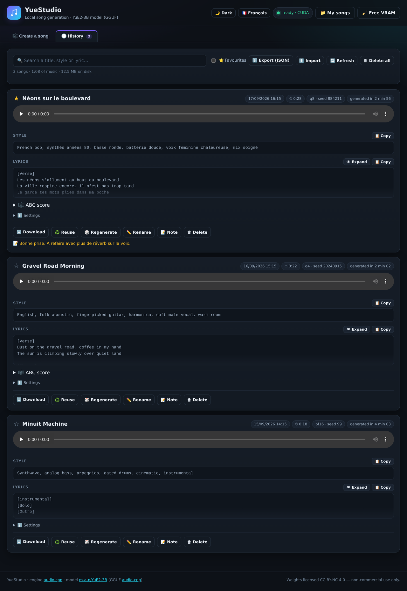
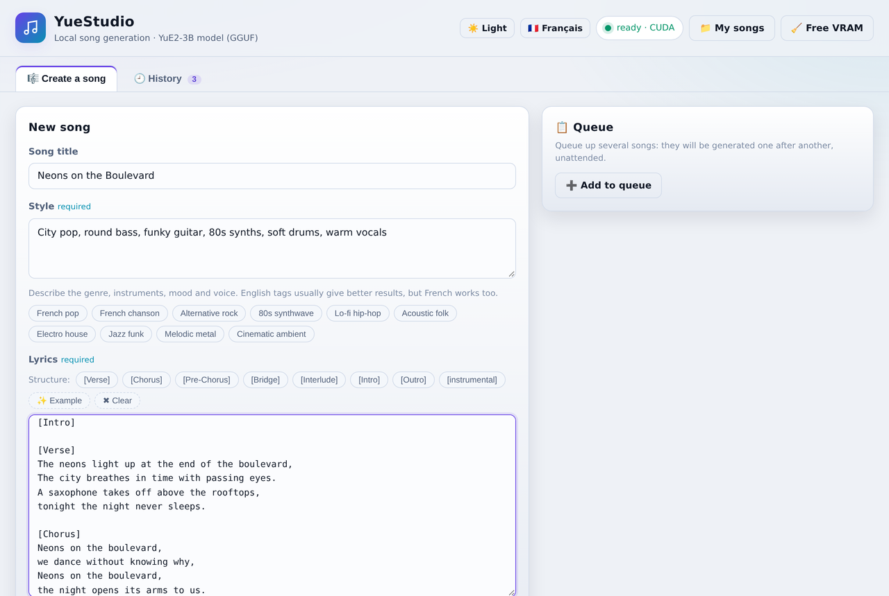
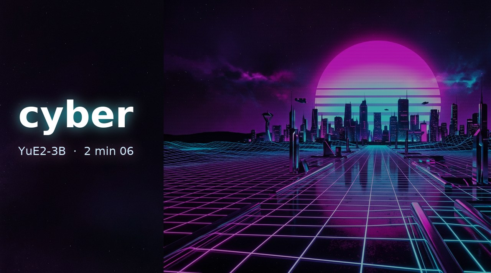

# 🎵 YueStudio

**Create complete songs — vocals and instruments — on your own PC. No subscription, no cloud, no account.**

You type a **title**, some **lyrics** and a **style**. YueStudio generates the track locally with
[YuE2-3B](https://huggingface.co/m-a-p/YuE2-3B) (through [audio.cpp](https://github.com/0xShug0/audio.cpp)),
saves it as a WAV file and files it into a replayable history.

> **Langue :** ce projet est français. [README en français →](README.md)
> The interface ships in French **and English** — there is a language toggle in the top bar, and a
> dark / light / system theme switch next to it. Both are remembered between sessions.

---

## 📸 Screenshots

**Create a song** (dark theme) — a title, a style, lyrics, one single button:


**History** — every song keeps its audio player, copyable style and lyrics, generation
parameters, ABC score and actions (reuse, regenerate, rename, note…):



Light theme and French interface at a glance:

| Light theme (English) | French interface |
|:---:|:---:|
|  |  |

---

## 🎧 Listen to an example

The track **"cyber"** was composed and performed entirely **on-device** by the model, on an ordinary PC
(i5-11400, 32 GB RAM, RTX 2000 Ada 16 GB). No account, no cloud, no subscription:

[](https://cdn.jsdelivr.net/gh/Tivaphe/YuEStudio@main/docs/exemples/2026-09-19_135052_cyber.mp3)

▶️ **[Listen to "cyber" — plays right in your browser](https://cdn.jsdelivr.net/gh/Tivaphe/YuEStudio@main/docs/exemples/2026-09-19_135052_cyber.mp3)**
— synthwave instrumental, **2 min 06**: one click and the track starts on its own in your browser's
audio player, nothing to install. *(MP3 192 kbps, 3 MB — or click the cover art.)*

- 💿 **The same take as a lossless WAV** (24 MB, 48 kHz / 16-bit stereo):
  [2026-09-19_135052_cyber.wav](https://github.com/Tivaphe/YuEStudio/raw/main/docs/exemples/2026-09-19_135052_cyber.wav)
  (download) — the files are versioned in [`docs/exemples/`](docs/exemples).
- ℹ️ The online playback goes through **jsDelivr**: GitHub serves its raw files with a
  `Content-Disposition: attachment` header, which forces a download instead of playback. So
  `raw.githubusercontent.com` links open a "Save as…" dialog rather than the audio.
- The exact recipe, to replay it on your machine:
  - **Style**: `Synthwave années 80, basse, nappes, rythme entraînant, chill` (French tags work too)
  - **Lyrics**: `[instrumental]` — no text lines, hence no vocals: the model plays instruments only.

<details>
<summary>🛠️ Why not an actual player "like on Hugging Face", right inside this README?</summary>

<br>

On Hugging Face, the model card shows the track with a real player, because the platform lets raw
HTML through:

```html
<audio controls preload="none" aria-label="Cyber Metal" src="…/cyber-metal.mp3"></audio>
```

**GitHub strips those tags.** Proof: sent to GitHub's Markdown rendering API (`POST /markdown`),
the `<audio …>` tag **vanishes** from the produced HTML — as do `<video>` and `<iframe>` — leaving
an empty paragraph. No custom player can render in a README, whatever the audio format (WAV, MP3,
OGG…).

**The only player GitHub accepts is its own**: paste a GitHub asset URL **alone on its line** and
GitHub turns it into an inline player with sound.

    https://github.com/user-attachments/assets/<id>

Those URLs cannot be crafted by hand: they are minted by **dragging the file into GitHub's web
editor** (README, issue or comment) while signed in.

The ready-to-drop file is provided:
[`cyber-readme-player.mp4`](docs/exemples/cyber-readme-player.mp4) — **2 min 06**, 1280×720,
cover art + AAC audio, 3 MB (the still frame shows the cover, the player carries the sound).
One-time procedure, from the repository owner's account:

1. open this README in GitHub's **web editor** (pencil ✏️ button);
2. **drag** `docs/exemples/cyber-readme-player.mp4` into the text field;
3. GitHub inserts a `https://github.com/user-attachments/assets/…` line: leave it **alone on its
   line**, where you want the player in the section;
4. save: the player shows up on the project page, with controls and sound.

This is also the official way to embed demo videos — nothing to host elsewhere.

</details>

---

## ✨ Why YueStudio

| | |
|---|---|
| 🖱️ **3 fields, 1 button** | Title, lyrics, style → 🎵 Generate. Everything else is optional. |
| 📦 **Zero dependency** | Server in **Python standard library only** (no pip, no conda, no venv), UI in HTML/CSS/JS with **no external library and no CDN**. |
| 🚀 **One-click install** | `1-INSTALLER.bat` downloads the engine and the model, verifies SHA-256 checksums and resumes interrupted downloads. |
| 🧠 **VRAM under control** | 3 quality levels (Q4 / Q8 / BF16), **lazy** model loading, automatic unload after 30 min idle. |
| 🕘 **Full history** | Every generation: playback, download, ABC score, copyable style and lyrics, reuse, regenerate, personal notes. |
| ✍️ **Lyrics assistance** | Lyrics guide + built-in **LLM prompt generator** (have ChatGPT / Claude / Gemini write your lyrics in the right format). |
| 🌗 **Dark / light / system theme** | One button, three states, persisted — with WCAG AA contrast in both themes. |
| 🌐 **French / English UI** | Instant switch, no reload, no lost state. |
| 🔌 **Everything stays local** | No data ever leaves your machine. The UI only listens on `127.0.0.1`. |
| 🪟 **Clean shutdown** | Closing the window **unloads the model** and stops the engine automatically. |

---

## 🧭 The interface

Two tabs, no account to create:

```
┌─ 🎼 Create a song ──────────────────────────────┬─ Tips ─────────────────┐
│ Title     [ Lights on the boulevard           ] │  The 3 golden rules    │
│ Lyrics    [ [Verse] …                         ]  │  for lyrics            │
│           [ structure tag buttons            ]  │                        │
│ Style     [ French pop, mid-tempo, …          ]  ├─ 🤖 Prepare with ──────┤
│                                                 │     an AI              │
│ ▸ Advanced settings (quality, planning, seed,   │  Style + subject →     │
│   steps, guidance, max duration, vocal          │  prompt ready to paste │
│   expressiveness)                               │  into ChatGPT/Claude   │
│                                                 │                        │
│              [ 🎵 Generate the song ]           │                        │
│  📋 Queue: ➕ Add · ⏳ 2 · ✅ 1                   │                        │
└─────────────────────────────────────────────────┴────────────────────────┘

┌─ 🕘 History ─────────────────────────────────────────────────────────────┐
│ ♪ Lights on the boulevard  ▶ ━━━●━━━ 0:52/2:58   ⬇  ✏️ 🔁  ♻️ 🎲 📝 🗑  │
│   Style : French pop, melancholic, mid-tempo, breathy female vocal       │
│   Q8 · 32 steps · seed 481516 · generated in 2 min 41 (RTF 0.94)         │
└──────────────────────────────────────────────────────────────────────────┘
```

The top bar holds the engine status, the songs-folder shortcut, the VRAM release button,
the **theme** switch (🌙 / ☀️ / 🖥️) and the **language** switch (🇬🇧 / 🇫🇷).

And also:

- **📋 Generation queue**: stack several songs (form or re-synthesis); they are generated
  one after another, unattended;
- **✏️ Editable ABC score**: fix the score of an existing song, then **🔁 Re-synthesize**
  (the engine plays your score instead of planning a new one, `cot = melody` or `full`)
  — or push it to the queue.

---

## 🖥️ Requirements

| Item | Minimum | Recommended |
|---|---|---|
| OS | Windows 10 / 11 **x64** | Windows 11 |
| Python | 3.10+ | 3.12 (`winget install -e --id Python.Python.3.12`) |
| GPU | NVIDIA 8 GB (CUDA) or any Vulkan GPU | NVIDIA 12 GB+ |
| RAM | 16 GB | 32 GB |
| Disk | 6 GB free | 14 GB (all quality levels) |
| Network | needed **once** (downloads) | — |

**Tested on:** ASUS ExpertCenter D500SC · i5-11400 · 32 GB · NVIDIA RTX 2000 Ada 16 GB.

Without an NVIDIA card the installer falls back to **Vulkan**, then to **CPU**
(it works, but it is very slow: 30 min+ for a 3-minute song).

> macOS and Linux are not packaged yet, although audio.cpp itself ships for both.

---

## 🚀 Installation

```bat
:: 0. Python, once (skip if already installed)
winget install -e --id Python.Python.3.12

:: 1. Unzip the archive anywhere, then:
1-INSTALLER.bat        :: engine + model (~5.5 GB, resumes if interrupted)
2-LANCER.bat           :: starts everything and opens http://127.0.0.1:8090
```

That's all. Nothing is installed into Windows: **everything lives inside the `YueStudio` folder**,
which you can move around or copy to a USB drive.

The launcher filenames are in French (`LANCER` = launch, `ARRETER` = stop) because the project
targets French users first; the interface itself has an English mode.

### Installer options

```powershell
.\installer.ps1                          # Q8 (recommended) + CUDA when available
.\installer.ps1 -Qualite q4              # lighter (~8 GB of VRAM)
.\installer.ps1 -ToutesQualites          # Q4 + Q8 + BF16 (~14 GB on disk)
.\installer.ps1 -Backend vulkan          # force Vulkan (no CUDA)
.\installer.ps1 -Verifier                # re-verify / repair existing files
.\installer.ps1 -SansLancement           # do not offer to start at the end
```

### Quality and VRAM

| Quality | Files | Peak VRAM | For whom |
|---|---|---|---|
| **Q4** — Fast | `q4_0` + `f16` VAE | ~7.8 GB | 8 GB GPUs, quick tests |
| **Q8** — Balanced ⭐ | `q8_0` + `f16` VAE | ~8.9 GB | **recommended**, 12 GB+ GPUs |
| **BF16** — Maximum | `bf16` + `f32` VAE | ~12.5 GB | 16 GB GPUs, best quality |

Quality is switched in **Advanced settings**, no reinstall needed (as long as the files are there).

---

## 🎧 Usage

1. **Title** — used to name the file and the history entry.
2. **Lyrics** — with structure tags (`[Verse]`, `[Chorus]`, …); the buttons above the field insert
   them for you.
3. **Style** — descriptive tags in English, comma separated: genre, tempo, instruments, mood,
   **voice type**. The preset chips **append to what you already typed** (they never clear the
   field, and never add a tag twice).
4. 🎵 **Generate** — the first generation loads the model (30 to 60 extra seconds), then expect
   **1 to 4 minutes for a 3-minute song** on a 16 GB GPU.

Every advanced setting shows its **default value**, its **real bounds** and its **recommended
range** right under the field; the **↺ Default values** button resets all of them at once.

Song duration **follows the length of the lyrics** (≈ 10 sung seconds per line, real ceiling of
6 minutes).

### No lyrics? Let an LLM write them

The **🤖 Prepare with an AI** card (right column) builds a prompt in the exact format YuE2 expects,
ready to paste into ChatGPT, Claude, Gemini or Mistral. It returns three blocks
`TITLE / STYLE / LYRICS` that you copy back into the form. The prompt itself exists in both French
and English and follows the interface language.

### History

Each card offers: ▶ playback · ⬇ download · 🎼 ABC score · 📋 copy style · 📋 copy lyrics ·
♻️ reuse · 🎲 regenerate (new seed) · 📝 notes · 🗑 delete.
Full JSON export/import of the history is included.

---

## ⏻ Shutting down: just close the window

There is **nothing else to do**:

```
closing the YueStudio window  (or Ctrl+C)
        ↓
1. the model is unloaded  → VRAM is released cleanly
2. the audio.cpp engine is stopped (it is a hidden child process)
3. yuestudio.pid is removed
```

Handled for **every** shutdown path: window close button, Ctrl+C, Windows session logoff and
shutdown (`SetConsoleCtrlHandler`), plus `SIGTERM` / `SIGBREAK` / `SIGHUP` and an `atexit` safety net.

Two extra safety nets:

- **browser tab closed** → a `POST /api/bye` beacon frees the VRAM while keeping the engine warm
  (instant reload if you come back);
- **30 minutes idle** → the engine unloads the model on its own (`idle_unload_ms`).

`3-ARRETER.bat` is kept as an **emergency script** (window killed brutally, orphan process).
The **🧹 Free VRAM** button in the UI does the same on demand.

---

## ✍️ Writing good lyrics

`GUIDE-PAROLES.md` (French) explains how the model actually behaves, verified against the engine
source code and the authors' official example. The essentials:

- **`[Intro]` and `[Interlude]` left empty** (tag then blank line) → instrumental passages;
- **duplicate the chorus**: 4 lines followed by an exact repeat of the same 4 lines;
- **6 to 10 syllables per line**, AABB or ABAB rhymes, homogeneous length inside a section;
- **everything about production goes into Style**, never into the lyrics;
- tags **always in English**, even for lyrics in another language.

`PROMPT-LLM.md` contains the full LLM prompt (French) with follow-up variations and the three
traps to watch for in the model's answer. The English version of that prompt is built into the app.

---

## 🩺 Troubleshooting

| Symptom | Fix |
|---|---|
| `Python est introuvable` (Python not found) | `winget install -e --id Python.Python.3.12`, then **reopen** the window. |
| SmartScreen blocks the script | More info → Run anyway. |
| Download interrupted | Run `1-INSTALLER.bat` again: it **resumes** where it stopped. |
| CUDA error at startup | NVIDIA driver too old, or `.\installer.ps1 -Backend vulkan`. |
| `insufficient memory` | Switch to **Q4**, close other GPU apps, then 🧹 *Free VRAM*. |
| Engine seems silent | The real error is in `engine\journal-moteur.log`. |
| Generation is very slow | Normal for long lyrics; `cot = off` and 8 steps speed it up a lot. |
| Antivirus deletes `audiocpp_server.exe` | Classic false positive on unsigned ggml binaries: exclude the folder. |

Full table and reset procedure: `LISEZ-MOI.md` (French).

---

## 📁 Project layout

```
YueStudio/
├─ 1-INSTALLER.bat        downloads engine + model (resume, SHA-256)
├─ installer.ps1          install logic (PowerShell 5.1+, no third-party module)
├─ 2-LANCER.bat           starts engine + UI, opens the browser
├─ 3-ARRETER.bat          emergency forced stop (normally useless)
├─ app/
│  ├─ server.py           HTTP server: UI, engine proxy, history, WAV files
│  ├─ index.html          interface (2 tabs, no external dependency)
│  ├─ app.js              front-end logic
│  ├─ i18n.js             translations (fr/en), themes (dark/light/system)
│  ├─ style.css           themable stylesheet (32 CSS variables)
│  └─ favicon.svg
├─ README.md              French readme (main)
├─ README.en.md           ← this file
├─ LISEZ-MOI.md           complete documentation (install, reference, troubleshooting)
├─ PREMIERS-PAS.md        5-minute getting started
├─ GUIDE-PAROLES.md       writing effective lyrics for YuE2
├─ PROMPT-LLM.md          the prompt to give an LLM to write your lyrics
├─ README.txt             plain-text version, no formatting
├─ docs/screenshots/      README screenshots
├─ docs/exemples/         "cyber" example track (streamable MP3, lossless WAV, cover, player MP4)
│
├─ engine/                created at install time: audio.cpp binaries + logs
├─ models/Yue2-3B-GGUF/   created at install time: GGUF weights (~3 to 13 GB)
├─ Mes chansons/          created on first run: generated WAV files
└─ historique.json        created on first run: generation metadata
```

The application code lives in **5 files**: `server.py` (~1,150 lines), `index.html`, `app.js`,
`i18n.js` and `style.css`.

---

## 🔌 Local API

`server.py` exposes a small JSON API on `127.0.0.1:8090`, handy for scripting generations:

| Method | Route | Purpose |
|---|---|---|
| GET | `/api/state` | engine state, backend, installed qualities |
| GET | `/api/history` | full history |
| POST | `/api/generate` | start a generation (`title`, `lyrics`, `style`, `quality`, `seed`, …); returns `202` when the engine is busy |
| GET | `/api/pending`, `/api/pending/<id>` | queues and running jobs |
| POST | `/api/update` | notes / metadata of an entry |
| POST | `/api/import`, GET `/api/export` | JSON import / export of the history |
| POST | `/api/unload` | unload the model (free VRAM) |
| POST | `/api/bye` | tab-close beacon |
| DELETE | `/api/history/<id>` | delete an entry and its WAV |
| GET | `/audio/<file>` | playback / download (supports `Range`) |

The audio.cpp engine is driven through its official API:
`POST /v1/tasks/run`, `POST /v1/tasks/unload_all_models`, `GET /health`, `GET /v1/models`.

---

## ⚖️ License

| Component | License | Scope |
|---|---|---|
| **YueStudio code** (`app/`, `*.bat`, `installer.ps1`, docs) | **MIT** | free, including commercial use |
| **YuE2-3B weights** (m-a-p) | **CC BY-NC 4.0** | ⚠️ **non-commercial use only** |
| **audio.cpp** | MIT | — |

In practice: **the code is free, but songs generated with the official weights fall under
non-commercial use**. Check the upstream license before any commercial use.

---

## 🙏 Credits

- **[m-a-p/YuE2-3B](https://huggingface.co/m-a-p/YuE2-3B)** — music generation model (lyrics → song).
- **[audio.cpp](https://github.com/0xShug0/audio.cpp)** — fast local inference (ggml), prebuilt Windows binaries.
- **[audio-cpp/Yue2-3B-GGUF](https://huggingface.co/audio-cpp/Yue2-3B-GGUF)** — weights converted to GGUF.

YueStudio is not affiliated with any of these projects: it is a wrapper that makes them usable in
one click on an ordinary PC.

---

## 🗺️ Roadmap ideas

- [x] Full French/English interface (toggle in the top bar)
- [x] Screenshots and an audio demo in this readme
- [x] Client-side generation queue (several songs in a row)
- [x] ABC score editing with re-synthesis
- [ ] Reference audio import (YuE2 *cover* workflow: `cot = melody`) — the ABC half already
  works (edit/paste a score, `cot = melody`); the audio half waits for audio.cpp to ship
  SheetSage2 (audio → score transcription) in a stable release
- [ ] Full English translation of the guides (`LISEZ-MOI.md`, `GUIDE-PAROLES.md`)
- [ ] macOS / Linux packages (audio.cpp already exists for both)

Contributions welcome: open an issue or a pull request.
