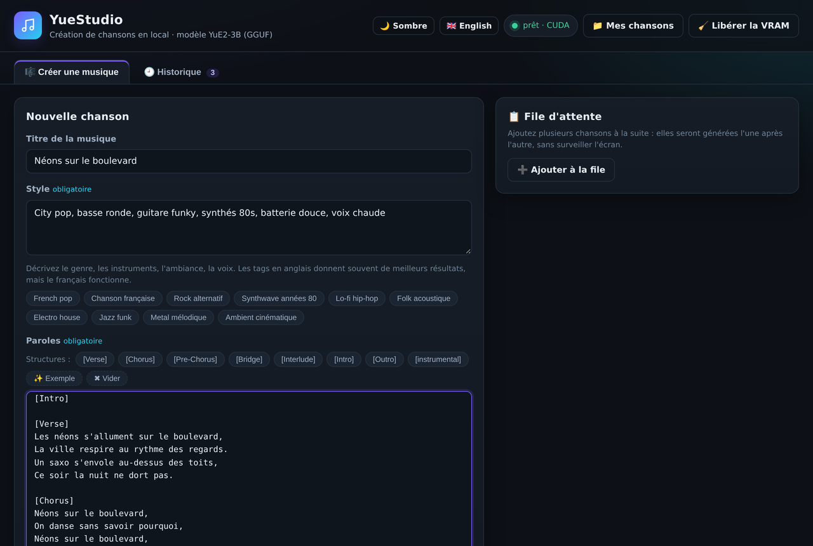
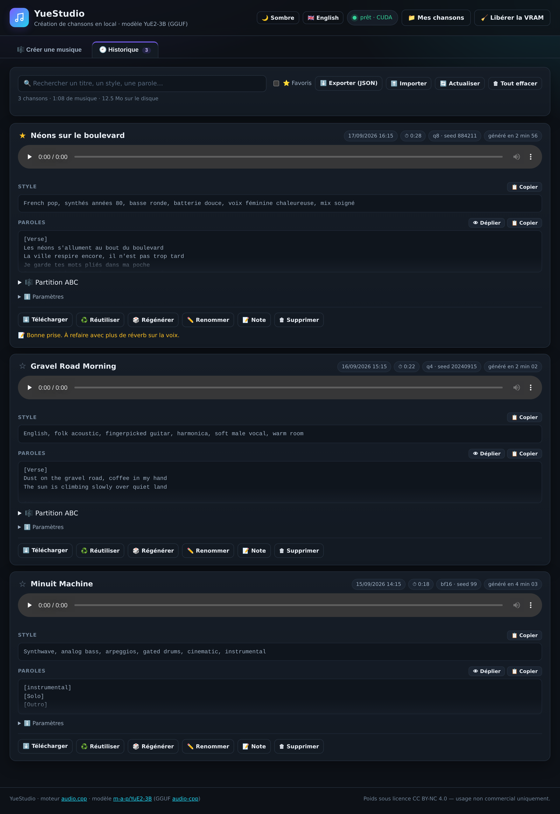
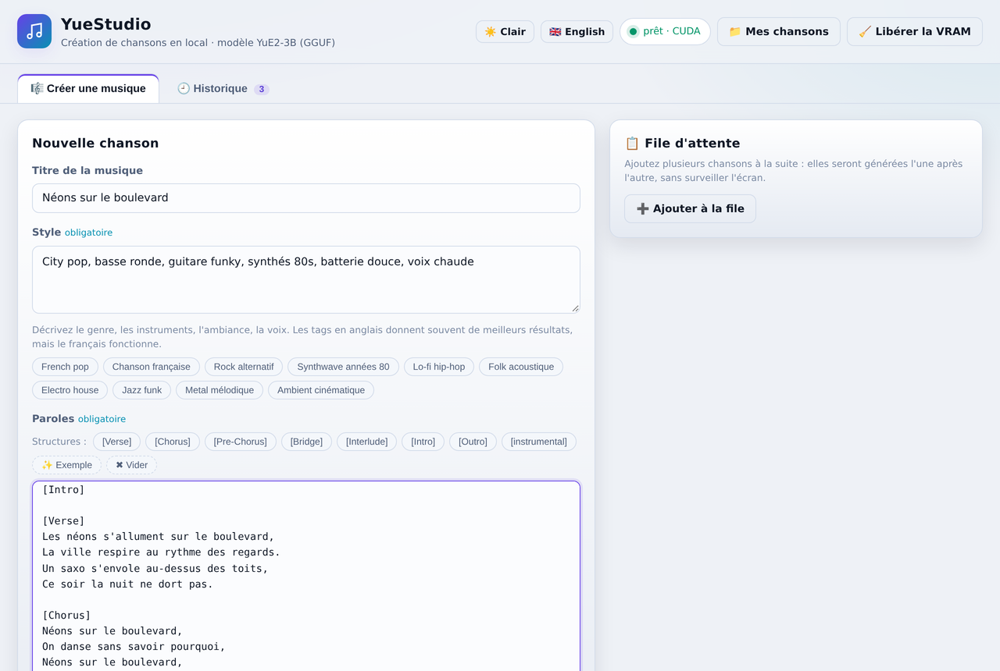
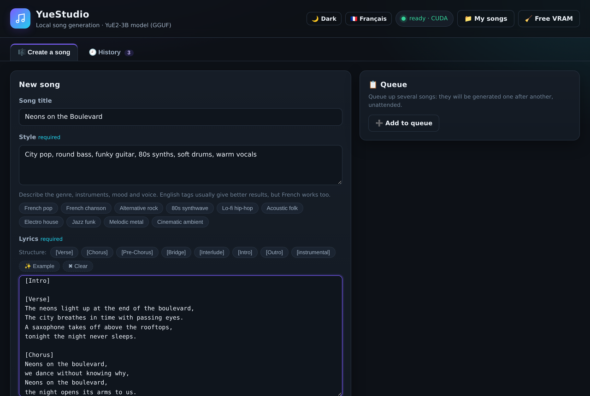

# 🎵 YueStudio

[**English readme →**](README.en.md)

**Créez des chansons complètes — voix et instruments — sur votre PC, sans abonnement, sans cloud, sans compte.**

Vous écrivez un **titre**, des **paroles** et un **style**. YueStudio génère le morceau en local avec
[YuE2-3B](https://huggingface.co/m-a-p/YuE2-3B) (via [audio.cpp](https://github.com/0xShug0/audio.cpp)),
l'enregistre en WAV et le classe dans un historique rejouable.

> *English: YueStudio is a self-contained Windows app that turns lyrics + a style prompt into a full
> song (vocals + instruments) entirely on your own machine, using the open YuE2-3B model through
> audio.cpp prebuilt binaries. No account, no subscription, no cloud, no Python dependency beyond the
> standard library. The UI is in French.*

---

## 📸 Captures d'écran

**Créer une musique** (thème sombre) — un titre, un style, des paroles, un seul bouton :



**Historique** — chaque chanson garde son lecteur audio, son style et ses paroles copiables,
ses paramètres, sa partition ABC et ses actions (réutiliser, régénérer, renommer, note…) :



Le thème clair et l'interface anglaise, d'un coup d'œil :

| Thème clair (français) | Interface anglaise |
|:---:|:---:|
|  |  |

---

## 🎧 Écouter un exemple

Le morceau **« cyber »** a été composé et joué entièrement **en local** par le modèle, sur un PC
courant (i5-11400, 32 Go de RAM, RTX 2000 Ada 16 Go) — sans compte, sans cloud, sans abonnement :

- 🎵 **[2026-09-19_135052_cyber.wav](docs/exemples/2026-09-19_135052_cyber.wav)** — instrumental
  synthwave, WAV à télécharger (GitHub ne sait pas lire l'audio dans un README : cliquez,
  téléchargez, écoutez).
- La recette exacte, pour la rejouer chez vous :
  - **Style** : `Synthwave années 80, basse, nappes, rythme entraînant, chill`
  - **Paroles** : `[instrumental]` — aucune ligne de texte, donc aucune voix : le modèle ne joue
    que les instruments.

---

## ✨ Pourquoi YueStudio

| | |
|---|---|
| 🖱️ **3 champs, 1 bouton** | Titre, paroles, style → 🎵 Générer. Tout le reste est optionnel. |
| 📦 **Aucune dépendance** | Serveur en Python **standard uniquement** (pas de pip, pas de conda, pas de venv), interface en HTML/CSS/JS **sans aucune librairie externe ni CDN**. |
| 🚀 **Installation en 1 clic** | `1-INSTALLER.bat` télécharge le moteur et le modèle, vérifie les empreintes SHA-256, reprend les téléchargements coupés. |
| 🧠 **VRAM maîtrisée** | 3 qualités (Q4 / Q8 / BF16), chargement **paresseux** du modèle, déchargement automatique après 30 min d'inactivité. |
| 🌗 **Thème sombre / clair / système** | Un bouton, trois états, mémorisé — contrastes WCAG AA dans les deux thèmes. |
| 🌐 **Interface français / anglais** | Bascule instantanée, sans rechargement ni perte d'état. |
| 🕘 **Historique complet** | Chaque génération : lecture, téléchargement, partition ABC, style et paroles copiables, réutilisation, régénération, notes personnelles. |
| ✍️ **Aide à l'écriture** | Guide des paroles + générateur de **prompt pour LLM** intégré (ChatGPT / Claude / Gemini écrivent vos paroles au bon format). |
| 🔌 **Tout reste local** | Aucune donnée ne quitte votre machine. L'interface n'écoute que sur `127.0.0.1`. |
| 🪟 **Arrêt propre** | Fermer la fenêtre **décharge le modèle** et coupe le moteur automatiquement. |

---

## 🌗 Thème et langue

Deux boutons en haut à droite, tous deux mémorisés entre les sessions :

- **🌙 Sombre / ☀️ Clair / 🖥️ Système** — cycle à trois états. *Système* suit le réglage de
  Windows et bascule tout seul quand l'OS change de thème. Les 32 couleurs de l'interface sont
  des variables CSS, les deux thèmes respectent les contrastes WCAG AA.
- **🇬🇧 English / 🇫🇷 Français** — bascule instantanée, sans rechargement : l'état du
  formulaire, la génération en cours et l'onglet affiché sont conservés. Le prompt pour LLM
  existe lui aussi dans les deux langues.

Le thème et la langue sont appliqués **avant le premier rendu** (script anti-scintillement dans
`<head>`), et le choix est conservé dans `localStorage`.

---

## 🧭 L'interface

Deux onglets, thème sombre, aucun compte à créer :

```
┌─ 🎼 Créer une musique ──────────────────────────┬─ Conseils ─────────────┐
│ Titre     [ Néons sur le boulevard            ] │  Les 3 règles d'or     │
│ Paroles   [ [Verse] …                        ]  │  des paroles           │
│           [ boutons de balises de structure  ]  │                        │
│ Style     [ French pop, mid-tempo, …         ]  ├─ 🤖 Préparer avec ─────┤
│                                                 │     une IA             │
│ ▸ Réglages avancés (qualité, planification,     │  Style + sujet →       │
│   graine, étapes, guidage, durée maximale,      │  prompt prêt à coller  │
│   expressivité du chant)                        │  dans ChatGPT/Claude   │
│                                                 │                        │
│              [ 🎵 Générer la chanson ]          │                        │
│  📋 File d'attente : ➕ Ajouter · ⏳ 2 · ✅ 1    │                        │
└─────────────────────────────────────────────────┴────────────────────────┘

┌─ 🕘 Historique ──────────────────────────────────────────────────────────┐
│ ♪ Néons sur le boulevard   ▶ ━━━●━━━ 0:52/2:58   ⬇  ✏️ 🔁  ♻️  📝   │
│   Style : French pop, melancholic, mid-tempo, breathy female vocal       │
│   Q8 · 32 étapes · seed 481516 · généré en 2 min 41 (RTF 0.94)           │
└──────────────────────────────────────────────────────────────────────────┘
```

Et aussi :

- **📋 File d'attente** : empilez plusieurs chansons (formulaire ou resynthèse), elles
  sont générées l'une après l'autre, sans surveillance ;
- **✏️ Partition ABC éditable** : corrigez la partition d'une chanson existante puis
  **🔁 Resynthétiser** (le moteur la rejoue au lieu d'en planifier une autre,
  `cot = melody` ou `full`) — ou envoyez-la dans la file.

---

## 🖥️ Prérequis

| Élément | Minimum | Recommandé |
|---|---|---|
| Système | Windows 10 / 11 **x64** | Windows 11 |
| Python | 3.10+ | 3.12 (`winget install -e --id Python.Python.3.12`) |
| Carte graphique | NVIDIA 8 Go (CUDA) ou GPU Vulkan | NVIDIA 12 Go+ |
| Mémoire vive | 16 Go | 32 Go |
| Disque | 6 Go libres | 14 Go (toutes les qualités) |
| Connexion | nécessaire **une seule fois** (téléchargements) | — |

**Configurations testées :** ASUS ExpertCenter D500SC · i5-11400 · 32 Go · NVIDIA RTX 2000 Ada 16 Go.

Sans carte NVIDIA, l'installeur bascule automatiquement sur **Vulkan**, puis sur le **CPU**
(fonctionnel mais très lent : comptez 30 min+ pour un morceau de 3 min).

---

## 🚀 Installation

```bat
:: 0. Python, une seule fois (ignorez si déjà installé)
winget install -e --id Python.Python.3.12

:: 1. Décompressez l'archive où vous voulez, puis :
1-INSTALLER.bat        :: moteur + modèle (~5,5 Go, reprend si coupé)
2-LANCER.bat           :: démarre tout et ouvre http://127.0.0.1:8090
```

C'est tout. Rien n'est installé dans Windows : **tout tient dans le dossier `YueStudio`**,
que vous pouvez déplacer ou copier sur une clé.

### Options de l'installeur

```powershell
.\installer.ps1                          # Q8 (recommandé) + CUDA si dispo
.\installer.ps1 -Qualite q4              # plus léger (~8 Go de VRAM)
.\installer.ps1 -ToutesQualites          # Q4 + Q8 + BF16 (~14 Go de disque)
.\installer.ps1 -Backend vulkan          # force Vulkan (pas de CUDA)
.\installer.ps1 -Verifier                # revérifie / répare les fichiers existants
.\installer.ps1 -SansLancement           # ne propose pas de démarrer à la fin
```

### Qualité et VRAM

| Qualité | Fichiers | Pic de VRAM | Pour qui |
|---|---|---|---|
| **Q4** — Rapide | `q4_0` + VAE `f16` | ~7,8 Go | GPU 8 Go, tests rapides |
| **Q8** — Équilibré ⭐ | `q8_0` + VAE `f16` | ~8,9 Go | **recommandé**, GPU 12 Go+ |
| **BF16** — Maximale | `bf16` + VAE `f32` | ~12,5 Go | GPU 16 Go, qualité maximale |

La qualité se change dans **Réglages avancés**, sans réinstallation (si les fichiers sont présents).

---

## 🎧 Utilisation

1. **Titre** — sert à nommer le fichier et l'entrée d'historique.
2. **Paroles** — avec les balises de structure (`[Verse]`, `[Chorus]`…) ; les boutons au-dessus du
   champ les insèrent pour vous.
3. **Style** — tags descriptifs en anglais, séparés par virgules : genre, tempo, instruments,
   ambiance, **type de voix**. Les puces de présélection **s'ajoutent à la suite** de votre texte
   (jamais d'effacement, jamais de doublon).
4. 🎵 **Générer** — la première génération charge le modèle (30 à 60 s de plus), puis comptez
   **1 à 4 minutes pour un morceau de 3 minutes** sur un GPU 16 Go.

Chaque réglage avancé affiche sous son champ sa **valeur par défaut**, ses **bornes réelles** et sa
**plage conseillée** ; le bouton **↺ Valeurs par défaut** remet tout d'un coup.

La durée du morceau **suit la longueur des paroles** (≈ 10 secondes chantées par ligne,
plafond réel de 6 minutes).

### Pas de paroles ? Laissez un LLM les écrire

La carte **🤖 Préparer avec une IA** (colonne de droite) construit un prompt de ~5 300 caractères
au format exact attendu par YuE2, à coller dans ChatGPT, Claude, Gemini ou Mistral. Il renvoie trois
blocs `TITRE / STYLE / PAROLES` prêts à recopier. Détails : [`PROMPT-LLM.md`](PROMPT-LLM.md).

### Historique

Chaque carte propose : ▶ lecture · ⬇ téléchargement · 🎼 partition ABC · 📋 copier le style ·
📋 copier les paroles · ♻️ réutiliser · 🎲 régénérer (nouvelle graine) · 📝 notes · 🗑 supprimer.
Export/import JSON de tout l'historique inclus.

---

## ⏻ Arrêt : fermez la fenêtre, c'est tout

Il n'y a **rien d'autre à faire** :

```
fermeture de la fenêtre YueStudio  (ou Ctrl+C)
        ↓
1. le modèle est déchargé  → la VRAM est libérée proprement
2. le moteur audio.cpp est coupé (c'est un sous-processus caché)
3. yuestudio.pid est supprimé
```

Géré pour **tous** les cas de fermeture : croix de la fenêtre, Ctrl+C, fermeture de session Windows
et extinction du PC (`SetConsoleCtrlHandler`), plus `SIGTERM`/`SIGHUP` et un `atexit` de sécurité.

Deux filets supplémentaires :

- **onglet du navigateur fermé** → un beacon `POST /api/bye` libère la VRAM tout en gardant le moteur
  chaud (rechargement immédiat si vous revenez) ;
- **30 minutes d'inactivité** → le moteur décharge le modèle de lui-même (`idle_unload_ms`).

`3-ARRETER.bat` reste fourni comme **script de secours** (fenêtre fermée brutalement, processus orphelin).
Le bouton **🧹 Libérer la VRAM** de l'interface fait la même chose à la demande.

---

## ✍️ Bien écrire ses paroles

[`GUIDE-PAROLES.md`](GUIDE-PAROLES.md) explique le fonctionnement réel du modèle, vérifié dans le code
du moteur et sur l'exemple officiel des auteurs. L'essentiel :

- **`[Intro]` et `[Interlude]` vides** (balise puis ligne vide) → passages instrumentaux ;
- **refrain dupliqué** : 4 lignes suivies de la répétition exacte des 4 mêmes lignes ;
- **6 à 10 syllabes par ligne**, rimes AABB ou ABAB, longueur homogène dans une section ;
- **tout ce qui est production va dans le Style**, jamais dans les paroles ;
- balises **toujours en anglais**, même pour des paroles en français.

---

## 🩺 Dépannage

| Symptôme | Solution |
|---|---|
| `Python est introuvable` | `winget install -e --id Python.Python.3.12`, puis **rouvrez** la fenêtre. |
| SmartScreen bloque | Informations complémentaires → Exécuter quand même. |
| Téléchargement coupé | Relancez `1-INSTALLER.bat` : il **reprend** où il s'était arrêté. |
| Erreur CUDA au démarrage | Pilote NVIDIA trop ancien, ou `.\installer.ps1 -Backend vulkan`. |
| `insufficient memory` | Qualité **Q4**, fermez les applis GPU, puis 🧹 *Libérer la VRAM*. |
| Le moteur semble muet | La vraie erreur est dans `engine\journal-moteur.log`. |
| Génération très longue | Normal si les paroles sont longues ; `cot = off` et 8 étapes accélèrent beaucoup. |
| Antivirus supprime `audiocpp_server.exe` | Faux positif classique sur binaires ggml non signés : excluez le dossier. |

Table complète et réinitialisation : [`LISEZ-MOI.md`](LISEZ-MOI.md#-dépannage).

---

## 📁 Structure du projet

```
YueStudio/
├─ 1-INSTALLER.bat        télécharge moteur + modèle (reprise, SHA-256)
├─ installer.ps1          logique d'installation (PowerShell 5.1+, sans module tiers)
├─ 2-LANCER.bat           démarre moteur + interface, ouvre le navigateur
├─ 3-ARRETER.bat          arrêt forcé de secours (normalement inutile)
├─ app/
│  ├─ server.py           serveur HTTP : interface, proxy moteur, historique, WAV
│  ├─ index.html          interface (2 onglets, aucune dépendance externe)
│  ├─ app.js              logique front
│  ├─ i18n.js             traductions (fr/en) et thèmes (sombre/clair/système)
│  ├─ style.css           feuille de style thémable (32 variables CSS)
│  └─ favicon.svg
├─ README.md              ← ce fichier (français)
├─ README.en.md           présentation en anglais
├─ LISEZ-MOI.md           documentation complète (installation, référence, dépannage)
├─ PREMIERS-PAS.md        prise en main en 5 minutes
├─ GUIDE-PAROLES.md       écrire des paroles efficaces pour YuE2
├─ PROMPT-LLM.md          le prompt à donner à un LLM pour écrire vos paroles
├─ README.txt           version texte brut, sans mise en forme
├─ docs/screenshots/    captures d'écran des README
├─ docs/exemples/       morceau exemple « cyber » (WAV à déposer)
│
├─ engine/                créé à l'installation : binaires audio.cpp + journaux
├─ models/Yue2-3B-GGUF/   créé à l'installation : poids GGUF (~3 à 13 Go)
├─ Mes chansons/          créé au premier lancement : les WAV générés
└─ historique.json        créé au premier lancement : métadonnées des générations
```

Le code applicatif tient dans **5 fichiers** : `server.py` (≈ 1 150 lignes), `index.html`,
`app.js`, `i18n.js`, `style.css`.

---

## 🔌 API locale

`server.py` expose une petite API JSON sur `127.0.0.1:8090`, utile pour scripter des générations :

| Méthode | Route | Rôle |
|---|---|---|
| GET | `/api/state` | état du moteur, backend, qualités installées |
| GET | `/api/history` | historique complet |
| POST | `/api/generate` | lance une génération (`title`, `lyrics`, `style`, `quality`, `seed`, …) ; renvoie `202` si le moteur est occupé |
| GET | `/api/pending`, `/api/pending/<id>` | files et travaux en cours |
| POST | `/api/update` | notes / métadonnées d'une entrée |
| POST | `/api/import`, GET `/api/export` | import / export JSON de l'historique |
| POST | `/api/unload` | décharge le modèle (libère la VRAM) |
| POST | `/api/bye` | beacon de fermeture d'onglet |
| DELETE | `/api/history/<id>` | supprime une entrée et son WAV |
| GET | `/audio/<fichier>` | lecture / téléchargement (gère `Range`) |

Le moteur audio.cpp est piloté via son API officielle :
`POST /v1/tasks/run`, `POST /v1/tasks/unload_all_models`, `GET /health`, `GET /v1/models`.

---

## ⚖️ Licence

| Composant | Licence | Portée |
|---|---|---|
| **Code de YueStudio** (`app/`, `*.bat`, `installer.ps1`, docs) | **MIT** | libre, y compris commercial |
| **Poids YuE2-3B** (m-a-p) | **CC BY-NC 4.0** | ⚠️ **usage non commercial uniquement** |
| **audio.cpp** | MIT | — |

Concrètement : **le code est libre, mais les morceaux générés avec les poids officiels relèvent d'un
usage non commercial** (projets personnels, démos, tests). Vérifiez la licence en vigueur avant tout
usage commercial.

---

## 🙏 Crédits

- **[m-a-p/YuE2-3B](https://huggingface.co/m-a-p/YuE2-3B)** — modèle de génération musicale (paroles → chanson).
- **[audio.cpp](https://github.com/0xShug0/audio.cpp)** — inférence locale performante (ggml), binaires Windows précompilés.
- **[audio-cpp/Yue2-3B-GGUF](https://huggingface.co/audio-cpp/Yue2-3B-GGUF)** — poids convertis en GGUF.

YueStudio n'est affilié à aucun de ces projets : c'est une interface d'assemblage qui les rend
utilisables en un clic sur un PC grand public.

---

## 🗺️ Idées d'évolution

- [ ] Capture d'écran et démo audio dans ce README
- [ ] Génération en file d'attente côté interface (plusieurs morceaux d'affilée)
- [ ] Édition de la partition ABC avec re-synthèse
- [ ] Import d'un audio de référence (workflow *cover* de YuE2 : `cot = melody`)
- [ ] Version anglaise de l'interface
- [ ] Paquet macOS / Linux (audio.cpp existe déjà pour ces plateformes)

Les contributions sont bienvenues : ouvrez une issue ou une pull request.
